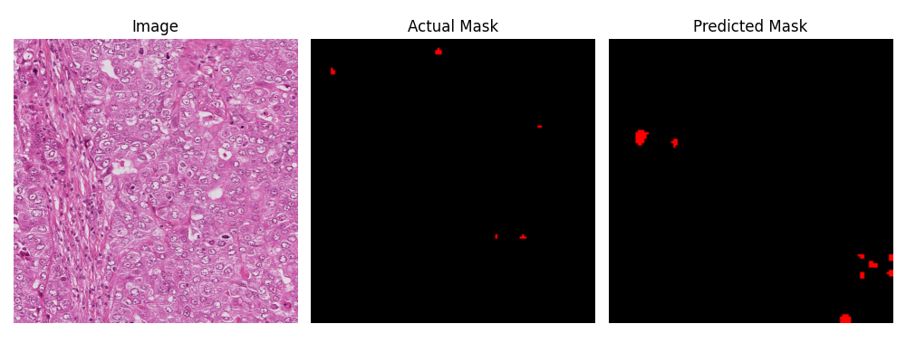

Mitosis Detection
==============================

Develop an AI algorithm that support histophathologists in the detection of Mitosis

Project Organization
------------

    ├── LICENSE
    ├── Makefile           <- Makefile with commands like `make data` or `make train`
    ├── README.md          <- The top-level README for developers using this project.
    ├── data
    │   ├── external       <- Data from third party sources.
    │   ├── interim        <- Intermediate data that has been transformed.
    │   ├── processed      <- The final, canonical data sets for modeling.
    │   └── raw            <- The original, immutable data dump.
    │
    ├── docs               <- A default Sphinx project; see sphinx-doc.org for details
    │
    ├── models             <- Trained and serialized models, model predictions, or model summaries
    │
    ├── notebooks          <- Jupyter notebooks. Naming convention is a number (for ordering),
    │                         the creator's initials, and a 
    short `-` delimited description, e.g.
    │                         `1.0-jqp-initial-data-exploration`.
    │   ├── EDA.ipynb
    │   ├── model.ipynb
    │   ├── Segformer.ipynb
    │   ├── UNet.ipynb
    │
    ├── references         <- Data dictionaries, manuals, and all other explanatory materials.
    │
    ├── reports            <- Generated analysis as HTML, PDF, LaTeX, etc.
    │   └── figures        <- Generated graphics and figures to be used in reporting
    │
    ├── requirements.txt   <- The requirements file for reproducing the analysis environment, e.g.
    │                         generated with `pip freeze > requirements.txt`
    │
    ├── setup.py           <- makes project pip installable (pip install -e .) so src can be imported
    ├── src                <- Source code for use in this project.
    │   ├── __init__.py    <- Makes src a Python module
    │   │
    │   ├── data           <- Scripts to download or generate data
    │   │   └── make_dataset.py
    │   │
    │   ├── features       <- Scripts to turn raw data into features for modeling
    │   │
    │   ├── models         <- Scripts to train models and then use trained models to make
    │   │   │                 predictions
    │   │   ├── Segformer
    │   │   └── UNet
    │   │   └── UNetC
    │   │
    │   └── visualization  <- Scripts to create exploratory and results oriented visualizations
    │
    └── tox.ini            <- tox file with settings for running tox; see tox.readthedocs.io


--------

General domain description
==========================

Mitotic count is an important parameter in breast cancer grading as it gives an evaluation of the agressiveness of the 
tumour. However, mitosis detection is a challenging problem and has not been addressed well in the literature. This is due
to the fact that mitosis are small objects with a large variety of shape configurations. The four main phases of a mitosis
are prophase, metaphase, anaphase and telophase. The shape of the nucleus  is very different depending on the phase of the
mitosis. On its last stage, the telophase, a mitosis has two distinct nuclei, but they are not yet full individual cells. 
A mitosis in telophase must be counted as a single mitosis, it should not be miscounted as two mitosis. Artefacts are also
common and should not be confused with mitosis. 

The data you receive are H&E stained histological images of different breast cancers prepared on 5 
slides and each slide is scanned on two scanners. The data of scanner A can be found in the folders A*; 
data of scanner H can be found in folders H* (e.g. data of slide 0 scanned on scanner A is in found A00_v2,
the same slide scanned on scanner H is found in H00_v2).

Our objective is to develop an algorithm that support histophathologists in the detecting of
mitosis on these type of images.

Data description
================

The data is organized as follows.

Each scanned image consists of a raw image, the desired output
as a pixel list and an overlay of both.

For example:
```
Input image: A00_00.png
Annotations: A00_00.csv
Overlay: A00_00.jpg
```
The annotations are organized one mitosis per line.
Each line lists the coordinates of all pixels belonging
to one mitosis segment.


## Create virtual environment
================

```
# create a virtual environment
user@systemname:project_directory$ conda craete -n seg python=3.9

# Activate virtual environment
(seg) user@systemname:project_directory$ conda activate seg

# Add created virtual environment to kernel list
(seg) user@systemname:project_directory$ conda install nb_conda_kernels

# Install all required libraries
(seg) user@systemname:project_directory$ pip install -r requirements.txt
```

## Solution

================

### Data statistics


### Create binary mask

```
(seg) user@systemname:project_directory$ python src/data/create_binarymask.py --root /path/to/root/folder
```

### Process dataset for train and val 

```
(seg) user@systemname:project_directory$ python src/data/process_dataset.py --root /path/to/root/folder --train /path/to/train/folder --val /path/to/val/folder
```

### NN Architectures

#### UNet 

U-Net architecture follows an encode-decode cascade structure, where the encoder gradually compresses information into lower-dimnesional representation. Then the decoder this information back to the original image dimension. Owing to this, the architecture gets an overall U-shape which leads to the name U-Net.


**Salient features**
- Both low-level and high-level information is important to Segment objects in an image.
- Skip connections which enable the flow of information from the encoder side to the decoder side, enabling the model to make better predictions.


#### SegFormer

SegFormer is a Transformer-based framework for semantic segmentation that unifies Transformers with lightweight multilayer perceptron (MLP) decoders.

**SegFormer has two appealing features:**
- SegFormer comprises a novel hierarchically structured Transformer encoder which outputs multiscale features.
It does not need positional encoding, thereby avoiding the interpolation of positional codes which leads to decreased performance when the testing resolution differs from training.
- SegFormer avoids complex decoders. The proposed MLP decoder aggregates information from different layers, and thus combining both local attention and global attention to render powerful representations.


### Metrics

The easiest metric to use in image segmentation tasks is pixel accuracy, as is obvious in its name, it helps us to find out the precision of pixel classification. Unfortunately, we can't completely depend on it, if the relevant pixels don't take much of a picture, then the pixel accuracy is very high, thus it didn't segment anything, so it's useless in this situation.

**The intersection over union (IoU)** is also known as the Jaccard index. Using IoU implies that we have two images to compare: one is our prediction and the other one is the ground truth, if the value obtained approaches number 1 that means the prediction is similar and close to our ground truth. And vice versa, the lower IoU, the worst our results.

$$
\text{{IOU}} = \frac{{\text{{Intersection Area}}}}{{\text{{Union Area}}}}
$$

### Train-Test Split

Train-Test split is done by applying 80-20 rule on each subfolder.


### UNet model (version 1.0)

#### Training
```
(seg) user@systemname:project_directory$ python src/models/UNet/train.py -d /path/to/root/folder -cp /path/to/save/checkpoints -e 100 -b 8 -l 3e-4 -s 572 -c 1
```

| Test Metric         | Score                   |
| :---:               | :---:                   | 
| train_loss          | 0.00198                 |
| valid_loss          | 0.0334                  |
| test_mean_iou       | 0.2369837               |
| test_mean_accuracy  | 0.9986399               |

#### Prediction

```
(seg) user@systemname:project_directory$ python src/models/UNet/predict.py --image /path/to/input/image.png --model_load /path/to/checkpoint/file.pth --save_dir /path/to/save/output
```
#### Sample output


### UNet model  (version 1.1)

The corresponding binary labels are provided in an in-out fashion, i.e. white for the pixels of segmented objects (mitosis) and black for the rest of pixels.

#### Training
```
python src/models/UNetC/train.py --batch-size 8 --test-batch-size 8 --epochs 10 --lr 0.0001 --n-classes 2 --data_dir /path/to/data/folder
```

#### Prediction
```
python src/models/UNetC/predict.py --model UNet100.pt --input /path/to/image/file.png --visualize
```

| Test Metric         | Epoch 3 | Epoch 8 | Epoch 10 |
| :---:               | :---:   | :---:   | :---:    | 
| test_loss           | 0.0523  | 0.0122  | 0.0058   |
| test_mean_iou       | 0.50    | 0.9500  | 0.9500   |
| test_mean_accuracy  | 0.99    | 1.0000  | 1.0000   |

#### Sample output

##### Epoch 3

##### Epoch 8

##### Epoch 10


### Segformer

#### Train model
```
(seg) user@systemname:project_directory$ python src/models/Segformer/train.py --data_dir /path/to/root/folder --checkpoint_dir /path/to/checkpoint/folder --epochs 50 --batch-size 8 --accelerator gpu --deviceid 1 --patience 10 -mi 10 -vmi 5
```

| Test Metric         | Score                   |
| :---:               | :---:                   | 
| test_loss           | 0.05111832916736603     |
| test_mean_accuracy  | 0.5                     |
| test_mean_iou       | 0.4995069001850329      |

#### Prediction

```
(seg) user@systemname:project_directory$ python src/models/Segformer/predict.py --data_dir /path/to/root/folder --checkpoint_dir /path/to/checkpoints/checkpointfile.ckpt --test_idx 5 --save_dir /path/to/save/folder
```
#### Sample output




## Summary

- State of the art techniques for image segmentation problems like UNet and Segformer are experimented for Mitosis detection.
- Neural networks often rely on a large amount of supervised data to obtain good results; therefore, data augmentation is heavily utilized. 
- Based on IOU score, UNet model appears to perform well with a score of `0.95`.
- With the UNet's average IOU score close to 1.0, it is observed that the model fails to predict Mitosis regions instead only background is predicted.
- As per literature, Segformer achieves state-of-the-art performance on multiple common datasets but with this dataset IOU score of only `0.4995069` is achieved.
- To enhance the detection performance of mitosis, efficient preprocessing techniques and a larger dataset of images are essential, considering that mitosis regions are small in size and occur infrequently within each image. 

## Next steps

- **Preprocessing/Augmentation:** To preserve vital information that may have been lost during image resizing, it is worth considering the approach of *creating patches using a sliding window technique*.
- **Model architecture modifications/Fine-tuning:** For SegFormer, pretrained model used is based out of ADE20K dataset. Idetifying and using a pretrained model which was built using a similar kind of dataset may help to improve the performance. 
- **Hyperparameter Optimization:** Default hyperparameters are used in the training procedure of UNet and SegFormer, they can be adjusted to suit the task. Perform a grid search or use automated techniques like random search or Bayesian optimization to find the optimal combination of hyperparameters that improves performance.
- **Evaluate and analyze errors:** Need further evaluation on UNet model's training procedure. In particular, the inclination of model towards predicting background than mitosis. Also, on the poor performance of semantic segmentation model with backbones (`models.ipynb`).
- **Increase training data:** Current dataset consists of only `98` samples. Increasing the diversity and size of the training set can enhance the model's ability to learn robust representations and improve its segmentation performance. *Usage of generative models like diffusion, GAN can be used for generating similar kind of training data but it requires domain experts validation.*  


## References
1. https://arxiv.org/pdf/1505.04597.pdf
2. https://arxiv.org/pdf/2105.15203.pdf
3. https://huggingface.co/blog/fine-tune-segformer
4. https://github.com/hayashimasa/UNet-PyTorch/


